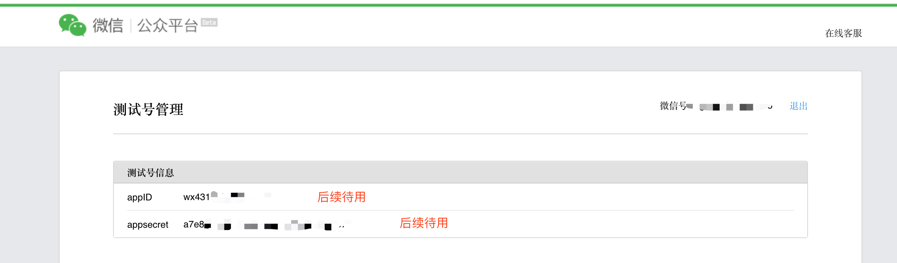
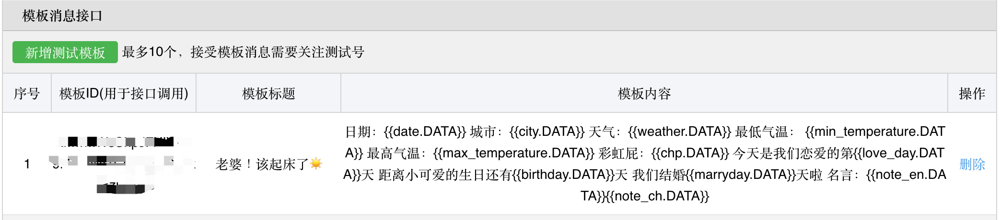

## 程序员版本（小白版本后续更新）

## 1. 前置条件
访问下面地址注册一个微信公众号测试号

https://mp.weixin.qq.com/debug/cgi-bin/sandbox?t=sandbox/login 

扫码登录成功后，就可以生成微信公众测试号的appID和appsecret
扫描测试号二维码后会生成微信号，那个账号需要接收就扫码



## 2. 新增测试模板


模板标题: 自定义，例如: 宝宝，早上好!  
模板内容参考:  

```
今天是{{date.DATA}}
城市：{{city.DATA}}
天气：{{weather.DATA}}
最低气温： {{min_temperature.DATA}}
最高气温：{{max_temperature.DATA}}
彩虹屁：{{chp.DATA}}
今天是我们恋爱的第{{love_day.DATA}}天
距离小可爱的生日还有{{birthday.DATA}}天
我们结婚{{marryday.DATA}}天啦
生理期{{period.DATA}}
名言：{{note_en.DATA}}{{note_ch.DATA}}
```
## 3. 安装python3 
官方网站: https://www.python.org/getit/

## 4. 安装requests包
打开cmd，执行以下命令
```commandline
pip3 install requests
```

## 5. 修改配置文件

编辑配置文件 `config.py`

`app_id`: 测试号信息里的appID 

`app_secret`: 测试信息里的appsecret

`template_id`: 模板消息接口里的模板ID

`user1`: 目标微信号

`user2`: 自己的微信号

`province`: 所在省份

`city`: 所在城市

`birthday`: 生日

`love_date`: 在一起的日子

`marry_date`:结婚日

`last`:最近一次生理期开始时间，填以前的也可以

`periodd_cycle`:生理期周期

`period_days`:生理期持续天数


## 6. 运行程序
```bash
#手动运行
python3 main.py
#如果你有服务器 Linux crontab 定时运行
crontab -e
0 7 * * * python3 /root/weixin/main.py #每天早上7点运行发送消息
```

**因为最近太忙，小白版本预计本周末（2023年7月2日）更新，有疑问可加V：zealzhangz**
